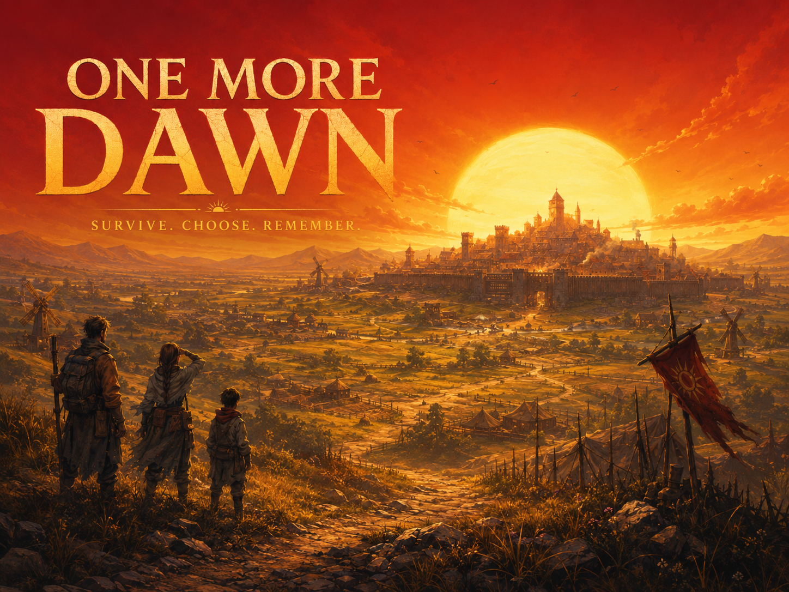

# One More Dawn



> A cooperative survival-strategy game for Reddit. One subreddit shares one
> persistent city, and every dawn reveals what its community built, chose,
> protected, or lost together.

Built for **Reddit's Games with a Hook Hackathon** on **Devvit Web**. The game
combines a **Three.js living city** with a **React strategy HUD**, backed by
server-validated shared state in Devvit Redis.

## What is One More Dawn?

One More Dawn turns a subreddit into the keeper of a last city.

The city does not begin as a finished kingdom. It begins as a vulnerable **Camp**
with few supplies, little protection, and a dawn approaching. Everyone in the
subreddit plays in the same city: no private islands, no separate settlements,
and no progress that exists only for one player.

Every contribution leaves a mark. A player who makes their first accepted
contribution receives a persistent house in the 3D city. The first contributor
becomes the founder. Shared labor raises essential civic buildings. Daily choices
change the resources and defenses that determine whether the city survives the
next raid.

> Build together today. Face dawn together. Rebuild together tomorrow.

## How to play

### 1. Enter the shared city

Open an One More Dawn game post in a participating subreddit. That subreddit has
one shared city that persists across its game posts. A new city begins as a Camp;
every community member sees the same city state.

### 2. Choose a survivor role

Pick a role and, optionally, name your survivor:

- **Scout** discovers opportunities and information.
- **Engineer** supports construction and infrastructure.
- **Medic** protects the city's people.
- **Farmer** strengthens food production.
- **Guard** strengthens the city's defenses.
- **Speaker** represents the community's voice.

Your role gives your contribution a place in the city's story. Roles can be
changed later, subject to the game's cooldown.

### 3. Spend daily energy helping the city

Each day, you receive three energy to use on meaningful actions:

- Grow Food
- Repair Power
- Treat Sick
- Guard Wall
- Add Labor to the current shared building

These actions are limited and server-validated. One person's action is small;
hundreds of small actions can change whether the whole city holds at dawn.

### 4. Build a place in the city

Your first accepted contribution creates your house in first-contribution order.
Every participant has one house; repeat contributions strengthen their standing
without creating duplicates.

The community also pools labor to unlock civic buildings. The settlement grows
through clear stages:

```text
Camp -> Settlement -> Village -> Fortified Town -> Surviving City
```

As shared construction completes, amenities such as shelters, farms, clinics,
watchtowers, storehouses, walls, and council facilities appear in the city. The
Three.js scene is a record of the city's real persistent state, not a decorative
background.

### 5. Make decisions with the community

The city is not governed by one player. Each day, the subreddit can:

- cast one vote in a **Crisis** with visible trade-offs;
- back one **Council strategy**;
- pledge to protect **The Marked**, a survivor or place in danger;
- discuss strategy, raids, rebuilding, and city life in the Reddit-connected
  **City Chatter Hub**.

Binding votes and pledges are made in-game. City Chatter opens real Reddit
discussion, so planning and community conversation remain connected to the
subreddit itself.

### 6. Prepare for dawn

The city tracks food, power, medicine, morale, threat, defense, and the raid
countdown. At dawn, the server resolves the consequences of the community's
preparation and decisions.

```text
Contributions -> Preparation -> Community decisions -> Raid at dawn
              -> Consequences -> Reconstruction
```

The protective dome may hold, weaken, or be breached. A raid can damage homes
and districts. Damage stays visible, and affected houses remain owned by the
same players.

### 7. Return to the Dawn Report and rebuild

The **Dawn Report** records what happened: resources gained or lost, votes and
pledges resolved, raid consequences, damaged homes, and what the city built.

When a house is damaged, the owner does not rebuild alone. Future community labor
is directed toward reconstruction. If a city falls entirely, **Phoenix Dawn**
begins a new Camp cycle while preserving long-term identity, titles, streaks,
and lifetime standing.

## More ways to participate

- **Reconnect the City** is a daily tile-rotation puzzle. Restore the damaged
  network to light an important district and earn personal Standing.
- **Shop** lets players use earned Coins for house cosmetics, while the community
  can work toward shared expansion and Beacon goals.
- **World** and **Top** views show other participating cities and contributors.
- The city timeline and live feed preserve the community's major events.

## Why it belongs on Reddit

Reddit communities already make decisions, form identities, disagree, help one
another, and remember their own history. One More Dawn makes those behaviors
visible in a shared world.

- The subreddit is the city, not just the audience.
- Participation is asynchronous; nobody needs to be online at the same time.
- Real Reddit discussion can support in-game strategy through City Chatter.
- A contributor's house makes their participation visible to the whole community.
- The city remembers consequences long after a single visit ends.

## Architecture

| Layer | Technology |
|---|---|
| Platform | Devvit Web (`@devvit/web`) |
| Client | Three.js, React 18, TypeScript, Vite |
| Server | Hono 4 in Devvit's serverless runtime |
| Persistence | Devvit Redis hashes and sorted sets |
| Cross-city state | `redis.global` World registry |

Important shared actions are validated on the server. Idempotent house
registration, per-player action limits, vote and pledge validation, deterministic
dawn resolution, and safe Redis parsing keep one shared city consistent when
many Redditors act at once.

## Repository layout

```text
src/
  shared/     Game types, balance, puzzles, houses, RNG, and map data
  server/     Devvit routes, resolver, Redis storage, and moderator actions
  client/     React HUD, Three.js scene, audio, styles, and API helpers
docs/
  V1_SCOPE.md         V1 scope and intentionally deferred features
  audit/              Private-subreddit smoke and release-audit material
  submission/         Devpost copy and video scripts
assets/
  one_more_dawn.png   README key art
```

## Development

```bash
npm ci
npm run type-check    # TypeScript project check
npm run lint          # ESLint
npm test              # Unit and integration tests
npm run build         # Vite build -> dist/{client,server}
npm run test:client   # Local mock-live browser smoke
```

Review the built client in a plain browser:

```bash
npm run build && node tools/preview-server.mjs
# http://localhost:4519
```

Iterate with the standalone Vite harness:

```bash
node node_modules/vite/bin/vite.js --config vite.dev3d.config.mjs
MOCK_API=1 node node_modules/vite/bin/vite.js --config vite.dev3d.config.mjs
```

`MOCK_API=1` enables a local mocked-live state. `MOCK_ROLE_NULL=1` tests
onboarding, and `MOCK_FALLEN=1` tests the fallen-city screen.

## Playtest and deployment

Use a private subreddit that you moderate and complete the human checks in
[`docs/audit/private-subreddit-v1-smoke.md`](docs/audit/private-subreddit-v1-smoke.md)
before publishing.

```bash
npm run login         # Authenticate the Devvit CLI
npm run dev           # Playtest on a test subreddit
npm run deploy        # Run gates, then upload to Devvit
npm run launch        # Publish after the private playtest passes
```

Do not automate Devvit authentication or publishing. Confirm real Reddit
identity, Redis persistence, moderator actions, comment attribution, and mobile
landscape behavior in the private-subreddit playtest.

## V1 boundaries

One More Dawn intentionally keeps V1 focused:

- No scavenge or expedition minigame is available in the live V1 interface.
- Sound and music use local assets with persisted mute controls; they never block
  gameplay.
- The survivor avatar is name-based; advanced avatar customization is post-V1.
- City traits and laws are computed server-side, while richer law management is
  planned for a later release.
- Every game post in a subreddit reads that subreddit's same shared city state.
- The live raid is forecast and report driven; the cinematic raid sequence is a
  local demo/showcase experience.

For the exact V1 contract, see [`docs/V1_SCOPE.md`](docs/V1_SCOPE.md).

## Credits

Sound and music attribution is recorded in [`docs/ATTRIBUTION.md`](docs/ATTRIBUTION.md).
